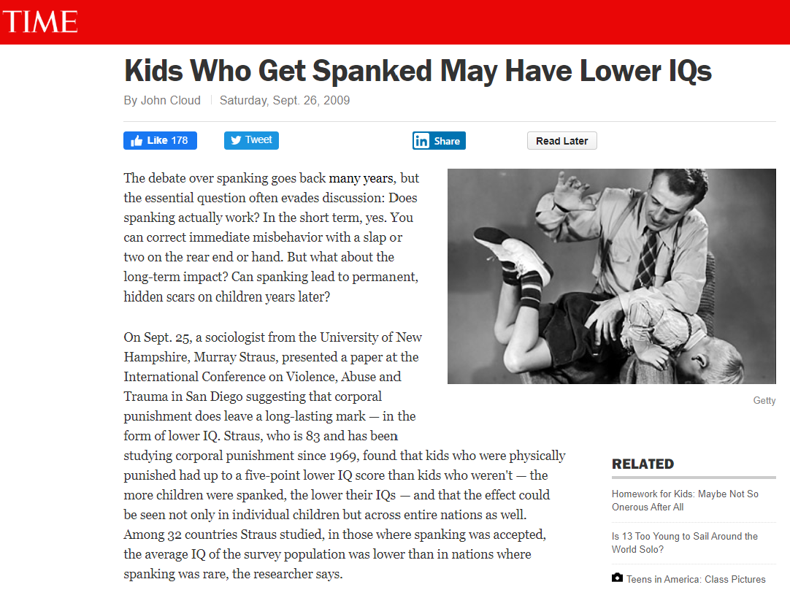

```{r setup, include=FALSE}
knitr::opts_chunk$set(echo = FALSE)
```

## First Day Survey

QR Code for First Day Survey


## Surveys

  >- A researcher often collects data about a population through surveys
  >- If the survey reaches the entire population it is called a census
  >- Typically surveys only sample a portion of the population
  >- Obtain a sample that is representative of the population is critical

## Categorizing a Survey 

  >- Two primary data collection methods
  >- Experiments and observational studies

## Disciminating Experiments and Observational Studies

  >- In observational studies, the researchers attempt to minimize any inteference with the subjects (merely observing or asking questions).
  
  >- In experiments, the researchers intentionally interfere with the subjects (usually through treatment variables)

## Goals of Observational Studies

  >- identify associations between variables
  >- generalize findings beyond the sample  


## Case Study

{width=60%}

[Times Article](http://content.time.com/time/health/article/0,8599,1926222,00.html)


## Spanking Study Details

  - The sample consisted of;  
    - 806 kids (age 2 to 4)
    - 704 kids (age 5 to 9) 

  >- IQ was measured at the beginning of the study and again 4 years later. 

  >- For the younger group, the average IQ of kids who were not spanked was 5 points higher.

  >- For the older group, the average IQ of kids who were not spanked was 2.8 points higher.

  >- These headlines all imply that spanking was the cause of the observed difference in IQ. 
  
  >- **Is this conclusion reasonable?** 


## Green Spaces Make Kids Smarter

An article is titled, "Green Spaces Make Kids Smarter."  

  >- sample was 2,623 schoolchildren in Barcelona. 
  
  >- primary variables were;
  
  >- amount of greenery around the children’s schools
    
  >- children’s year-long improvement in working memory and attention span
    
  >- The children who had more vegetation around their schools showed more progress on the memory and attention test over the course of a year.

  >- **Is this conclusion reasonable?**


## Differences in Possible Conclusions from Experiments and Observational Studies

When examining data we can often find associations / relationships between variables, but we should be skeptical of concluding causation.

  >- In observational studies, it is possible to identify associations between variables.
  >- In a properly run experiment, it is possible to infer causal relationships between variables.
  >- There are techniques that attempt to determine causality from observational studies.
  >- **Caution**: association does not imply causation.
  
## Types of Variables

  >- Categorical / Qualitative
    
  >- Numerical / Quantitative


## List of Variables from Survey 

In your groups, classify each variables as either **categorical** or **numerical**

<div style="float: left; width: 50%;">

  - name
  - section
  - n_courses
  - n_semesters
  - n_credits_earned
  - enrolled_hybrid_online
  - transporation_method
  - distance_miles

  
</div>

<div style="float: right; width: 50%;">

  - distance_minutes
  - taken_statistics
  - taken_cc_statistics
  - highest_math
  - comfort_decimals
  - commitment
  - missed_days
  - wake_by_alarm

</div>
