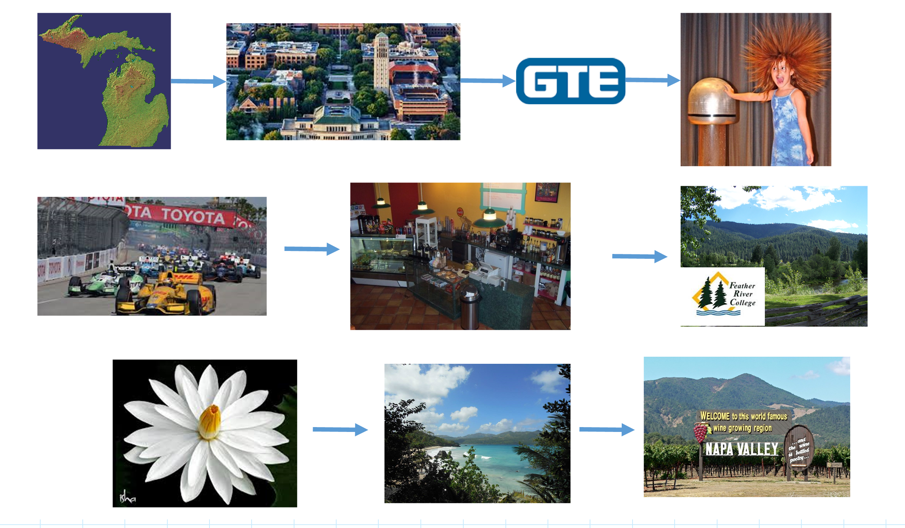

```{r setup, include=FALSE}
knitr::opts_chunk$set(echo = FALSE)
```

## Course Start-Up

Welcome to Math 159 - Statistics.  As we wait for everyone to arrive, you can complete these tasks;

<div style="float: left; width: 50%;">

  - construct a name plate **First Name , Last Initial** on both sides
  - complete on-line 1st Day Survey (QR code below) - actual link in Canvas announcement
  - 

  
</div>

<div style="float: right; width: 50%;">

  - begin on student information form
  - read syllabus on Canvas


</div>

## My Journey Here




## Course Big Picture

This course introduces you to modern statistical data analysis techniques so that you can make data-informed decisions. At the end of the semester you will present your research findings in a poster presentation format to your peers.

In this project-based course, you will have the opportunity to answer questions that you feel passionately about through independent research based on existing data. The course offers a lot of one-on-one support, directed opportunities to work with other students, and training in the skills required to complete a project of your own design. We will use collaborative tools and software that are common in many workplaces and research labs. These skills will prepare you for many different career types.

## Course Philosophy

  >- I aspire to develop an inclusive learning community with a supportive culture for all students. 

  >- My intention is to create a climate that allows my student to be empowered and in control of their learning.  

  >- Class time is an opportunity to engage with and collaboratively process statistical ideas.  

  >- This requires students to publicly share and explain their thinking and understanding.  

  >- My main role is to inquire into student thinking and provide support that promotes further development.  

  >- My ultimate aim is to provide an environment that allows my students the freedom and support to creatively explore statistical concepts.

## Supportive Learning Community

  >- In our classroom, the strength of diversity and individual differences are respected, appreciated, and recognized as a source of strength.  
  
  >- Students are encouraged and expected to speak up and participate during class and to carefully and respectfully listen and respond to each other.  
  
  >- Any attitudes or actions that are destructive to the sense of community that we strive to create are not welcome and I will actively monitor and address any concerns.


## Grading Components

  >- weekly assignments (30%)
  >- preparatory quizzes (10%)
  >- learning journal (10%)
  >- in-class activities (10%)
  >- project (20%)
  >- exams (20%)

## Learning Materials

  >- [Syllabus](https://docs.google.com/spreadsheets/d/1YZLfiyLst8LQpotE0RUOWvw54hWWXJw4AQYgt627Z8Q/edit?usp=sharing)

  >- [OpenIntro Statistics](https://leanpub.com/openintro-statistics)
  
  >- [Passion Driven Statistics Videos](https://www.youtube.com/watch?v=_8A0zx51BKs&feature=youtu.be)
  
  >- [RAD_course_notes](https://norcalbiostat.github.io/MATH315/reading/RAD_course_notes_f19.pdf)

  >- [ModernDive](https://moderndive.netlify.com/)
  
  >- [RStudioCloud](rstudio.cloud)
  
  >- [Slack](https://rico-159-s20.slack.com)


## Expectations

In your groups discuss the following;  

  - What do you expect from a classmate in group settings?
  - What is challenging for you when working in a group?
  - How can we support eachother in groups?
  
## Your Next Steps 

  - Bring your fully charged laptop to class
  - Download Learning Materials (OpenIntro, RAD notes)
  - Start on Assignment #1 - Introduction (File in Canvas)
  - Access the Syllabus and Calendar (a single Google Document)
    - Get started on the readings and videos
    
  


