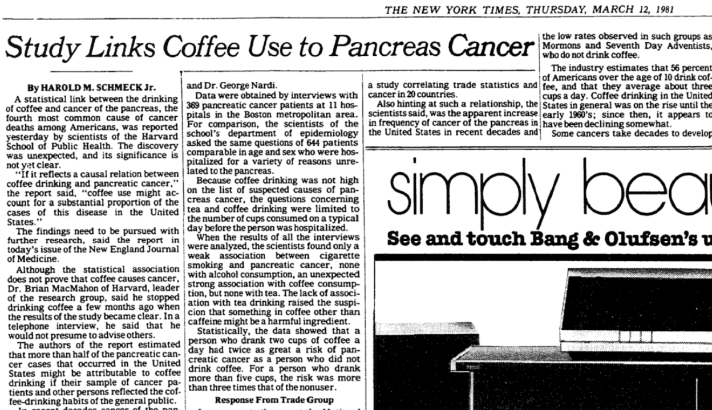

```{r setup, include=FALSE}
knitr::opts_chunk$set(echo = TRUE)
```

## Study Links Coffee Use to Pancreas Cancer (1981)

{width=85%}

## A prospective study of coffee intake and pancreatic cancer: results from the NIH-AARP Diet and Health Study

## Hazard Ratio / Relative Risk


## Including Plots

You can also embed plots, for example:

```{r pressure, echo=FALSE}
plot(pressure)
```

Note that the `echo = FALSE` parameter was added to the code chunk to prevent printing of the R code that generated the plot.
