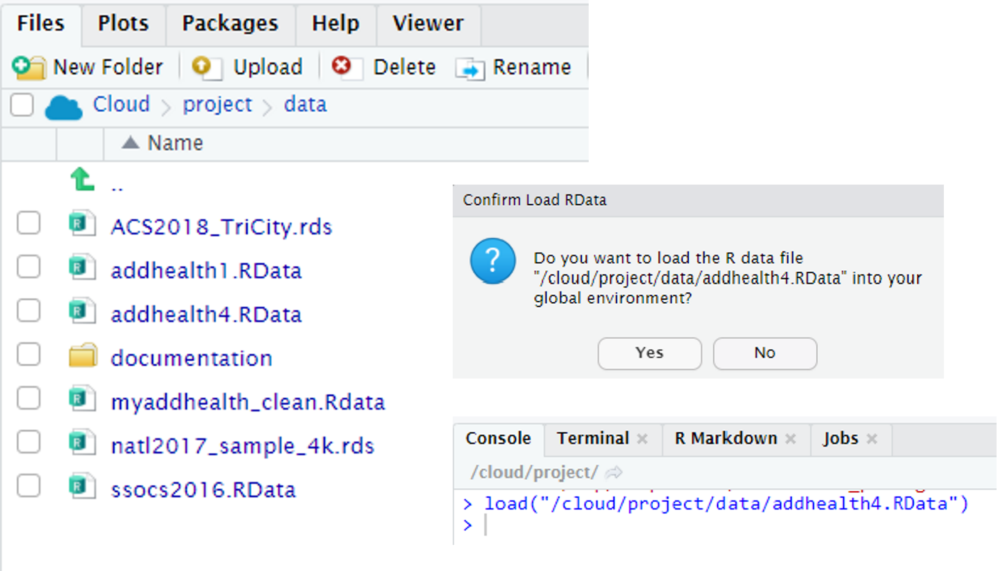
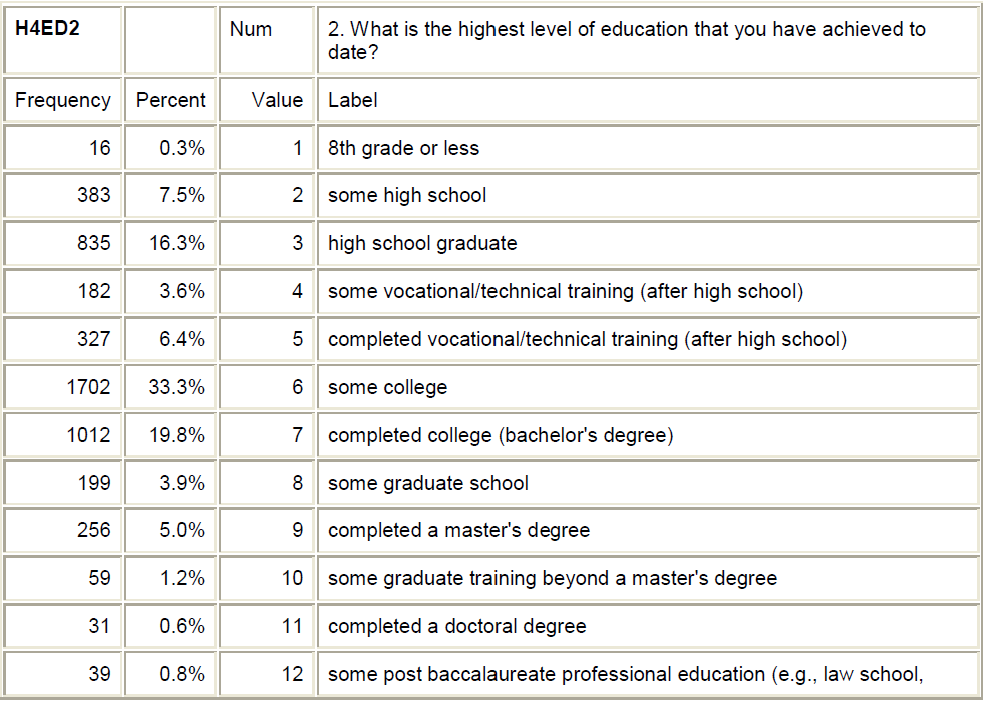
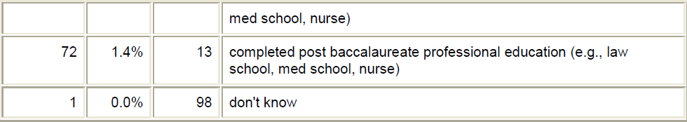

## Knitr Options

```{r setup, include=T}
knitr::opts_chunk$set(echo = TRUE)
```

  >- `echo` = **TRUE** tells Knit operation to show code along with output for all chunks

## Library Command

```{r, message=FALSE, warning= F}
library(dplyr)
library(janitor)
```

  >- loads in the `dplyr` and `janitor` packages

## Getting the data file into the R environment

An easy trick is to click on the data and look in the `Console` for the proper function notation.

{width=50%}

Once you know the command - copy it and insert it in a chunk.

```{r}
load("/cloud/project/data/addhealth4.RData")
```


## Trimming your data file to just the variables you want 

```{r}
mydata_raw <- addhealth4 %>% 
  select(H4ID1, H4ED2)
```

  >- we just selected two variables `H4ID1` and `H4ED2` from the `addhealth4` data frame and placed it into a new dataframe called `mydata_raw`

## `glimpse` the new dataframe

```{r}
glimpse(mydata_raw)
```

## Looking at Codebook for `H4ID1`


## Mutate and Recoding Functions

```{r}
mydata_c <- mydata_raw %>% 
  mutate(health_limit_activity = recode_factor(H4ID1,
                             "1"="not limited",
                             "2"="limited a little",
                             "3"="limited a lot",
                             "8"="don't know",
                             .ordered=T))
                              
```

## Checking the accuracy of your work - Option 1

```{r}
mydata_c %>% 
  tabyl(H4ID1,health_limit_activity)
```

## Checking the accuracy of your work - Option 2

```{r}
mydata_c %>% 
  tabyl(health_limit_activity) %>% 
  adorn_pct_formatting(digits=1) %>% 
  adorn_totals()
```

## Categorical Variable with many levels {.smaller}

Example 3 -`H4ED2` variable.  Check the Codebook  
{width=50%}  
{width=50%}

## Recoding to 4 levels

```{r}
mydata_c <- mydata_raw %>% 
  mutate(educ_completed = recode_factor(H4ED2,
                             "1"="not hs grad",
                             "2"="not hs grad",
                             "3"="hs grad",
                             "4"="hs grad",
                             "5"="hs grad",
                             "6"="hs grad",
                             "7"="bachelors",
                             "8"="bachelors",
                             "9"="adv degree",
                             "10"="adv degree",
                             "11"="adv degree",
                             "12"="bachelors",
                             "13"="adv degree",
                             "98"="don't know",
                             .ordered=T))
                              
```

## Checking accuracy

```{r}
mydata_c %>% 
  tabyl(educ_completed) %>% 
  adorn_pct_formatting(digits=1) %>% 
  adorn_totals()
```

## Try again - Recode to 5 levels

```{r}
mydata_c <- mydata_raw %>% 
  mutate(educ_completed_5 = recode_factor(H4ED2,
                             "1"="not hs grad",
                             "2"="not hs grad",
                             "3"="hs grad",
                             "4"="post hs",
                             "5"="post hs",
                             "6"="post hs",
                             "7"="bachelors",
                             "8"="bachelors",
                             "9"="adv degree",
                             "10"="adv degree",
                             "11"="adv degree",
                             "12"="bachelors",
                             "13"="adv degree",
                             "98"="don't know",
                             .ordered=T))
                              
```

## Checking accuracy

```{r}
mydata_c %>% 
  tabyl(educ_completed_5) %>% 
  adorn_pct_formatting(digits=1) %>% 
  adorn_totals()
```

## Recode to a Binary Variable (Yes/No)

```{r}
mydata_c <- mydata_raw %>% 
  mutate(college_deg = recode_factor(H4ED2,
                             "1"="no",
                             "2"="no",
                             "3"="no",
                             "4"="no",
                             "5"="no",
                             "6"="no",
                             "7"="yes",
                             "8"="yes",
                             "9"="yes",
                             "10"="yes",
                             "11"="yes",
                             "12"="yes",
                             "13"="yes",
                             "98"="don't know",
                             .ordered=T))
                              
```

## Checking accuracy

```{r}
mydata_c %>% 
  tabyl(college_deg) %>% 
  adorn_pct_formatting(digits=1) %>% 
  adorn_totals()
```
