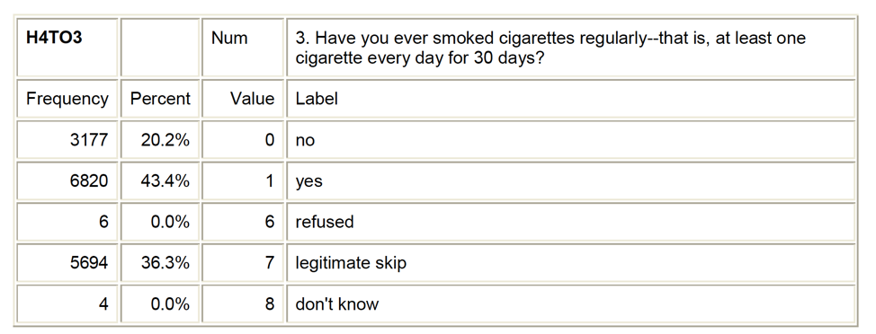

# Overview

Now it is time for you to formulate your own Research Question and refine it using current literature. This will guide your focus for the rest of the semester. In this assignment you will

1. Decide on a specific research topic
2. Choose variables that relate to your topic
3. Formulate a Research Question
4. Conduct a literature review to learn more about your topic

# Instructions
The specific details for each step are described below. You will write the assignment directly in a Google document. 

* Use header formats to clearly denote each step
* Write your assignment using the template provided, and upload in Canvas.
* Name the template file `hw02_rq_name` i.e. `hw02_rq_jose_rico.html` 

## Peer Review
This assignment will be subject to peer review, but with no revision period. 
After the due date, check the [Peer review assignment sheet for your assignment(s). 
In Google Docs directly, use the commenting feature to provide feedback on this assignment. 
Check the [[project]](../project.html) page for instructions on how to provide a review. 

What specifically to look for: 

* Is the topic area statement clearly stated? Do you understand what they are investigating? 
* Do the variables chosen match the stated topic area? 
* Will the variables chosen actually measure or describe the variables in the research question? 
* Are the research questions stated as clear hypotheses? 
* Are the sources cited all primary research articles? 
* Do the sources inform the stated research question? 

# Topic area statement: 
Thoroughly review the codebook for your dataset of choice and make note of topics that interest you. Use this as a brainstorming session and identify as much as you can. Write a statement similar to the one below regarding what topic(s) you are interested in. You should also explain WHY you are interested in your topic. 

> Example:
After looking through the codebook for the U.S. Longitudinal Study of Adolescent to Adult Health study database, I have decided that I am particularly interested in nicotine dependence. I am not sure which variables I will use regarding nicotine dependence (e.g. symptoms or diagnosis) so for now I will include all of the relevant variables in my personal codebook. While nicotine dependence is a good starting point, I need to determine what it is about nicotine dependence that I am interested in. It strikes me that friends and acquaintances that I have known through the years that became hooked on cigarettes did so across very different periods of time. Some seemed to be dependent soon after their first few experiences with smoking and others after many years of generally irregular smoking behavior. I decided that I am most interested in exploring the association between level of smoking and nicotine dependence. Below I have added to my codebook variables reflecting smoking levels (e.g. smoking quantity and frequency). If my topic is too vague, I would like to bring suicide in. I would be interested to see if there is any relationship between level of smoking with nicotine dependence and suicide.

# Personal Codebook: 
Create your personal codebook. You will create a trimmed down version of the codebook to help you not get overwhelmed with the larger pool of available questions. 

* In your personal codebook, include the questions/items/variables from the full data codebook that measure your selected topics. 
* Choose between 5 and 10 variables. This is just a starting point, you can modify anytime later. 
* **Do not go overboard here. Excessive variables being chosen indicate lack of thought and will not be reviewed highly**
* Do this by taking little screenshots with the snipping tool or using copy/paste. In the pdf file, go to Edit, Take a Snap Shot, then click and drag over what you want. If you are on a MAC, press Shift+Command+Ctrl+4 to get the snip tool.
* **Do not attempt to re-write the codebook manually**

> Example Codebook screenshots

# Draft a few Research Questions

Now that you have a few topics and picked out variables for each topic, what questions are you interested in trying to answer about your topics? One of the simplest research questions that can be asked is whether two constructs are associated. You will write 2-3 questions, and then refine based off information you learn from conducting a literature review (next part of this assignment).

Your research questions should be written as 

* a relationship between two measurements
* a testable hypothesis (can you answer yes or no to the question?)

> Questions example:  
> a) Does smoking quantity relate to nicotine dependence?  
> b) Is there a relationship between smoking frequency and suicide?  
> c) Does a smoker have more suicidal behaviors than a non-smoker?  

# Literature review

To refine your research question you need to know what has been studied in recent years. Before you start this assignment be sure to have read the article on "how to read a journal article", and the lecture notes on "how to conduct a literature review". This assignment will help you identify gaps in the current literature regarding your research topic, and refine your research question and set of potential variables substantially. 

You need at least 3 primary source references that are directly related to your topic that were published in 2008 or more recent.

For each article, you will complete steps 1-3, in other words 3 times. There is an example at the bottom of this document.

## Step 1: 
* Put the reference for the article in APA style. Here is a link to Purdue Owl APA style references that will guide you. https://owl.english.purdue.edu/owl/resource/560/05/ 
* NOTE: If you use a citation creator you still need to compare each part of all your references to make sure it was done correctly. The citation creator usually messes up on something.
* Good/suggested bibliography managers
    - BibDesk (Mac) http://bibdesk.sourceforge.net/ 
    - Zotero (in browser) https://www.zotero.org/
    - Mendeley (download) https://www.mendeley.com/ 
* Using reference managers such as zotero and *.bib files with R Markdown
    - https://tclavelle.github.io/blog/reference_tips/
    - http://svmiller.com/blog/2016/02/svm-r-markdown-manuscript/
    - http://rmarkdown.rstudio.com/authoring_bibliographies_and_citations.html#citations_for_pdf_output

## Step 2: 
Read an article, type up a brief summary (a few sentences) of what you learned about your topic from introduction/lit review and the discussion. This summary should convey the main themes and findings overall for the literature review and discussion in your own words.

## Step 3: 
Then explain how the article is going to help you with writing up your project. This is an explanation of what the article contributes to your project, not a restating of the summary. For example, is it going to help explain one or both of your topics, does it explain a key theory, what argument does it help you build for your project?

## Example

My research question is: Is self-efficacy associated with parent relations and academic performance?

**Weiser, D. A., & Riggio, H. R. (2010). Family background and academic achievement: Does self-efficacy mediate outcomes? Social Psychology of Education: An International Journal, 13(3), 367-383.**

2. This article discusses whether self-efficacy mediates the relationship between family background and academic achievement. This is very similar to my topic but I feel that the component of mediation changes it slightly. I found that family predictors did not correlate with academic achievement as much as self-efficacy correlates with parent’s expectation of academic success. Self-efficacy is linked to grade point average and academic success expectations.
3. This information will be vital to understanding the extent to which self-efficacy is related to academic performance. With the correlation being weak for family background and academic performance, it will do less to determine the connection of parental relations to self-efficacy.

**Turner, E. A., Chandler, M., & Heffer, R. W. (2009). The influence of parenting styles, achievement motivation, and self-efficacy on academic performance in college students. Journal of College Student Development, 50(3), 337-346.**

2. This study looks at how parenting styles, authoritative in particular, relate to academic performance, self-efficacy, and intrinsic motivation in college students. It claims that all factors, academic performance, self-efficacy, and intrinsic motivation, are all influenced by authoritative parenting. What I learned about my topic is this study did find that self-efficacy was not significantly linked to authoritative parenting.
3. This article will help explain how this specific type of parenting, authoritative, has little affect of self-efficacy. It does not however, claim that parenting, as a whole has not effect on self-efficacy. This study does confirm that parenting does reflect on academic performance.

**Junttila, N., Vauras, M., & Laakkonen, E. (2007). The role of parenting self-efficacy in children's social and academic behavior. European Journal of Psychology of Education, 22(1), 41-61.**

2. This article looks at parenting self-efficacy. This is a little different from my topic but there are aspects of it that will be useful. It tested Finnish mothers and fathers to test for loneliness, parent self-efficacy, their child’s peer evaluated social competence, self-evaluated loneliness and academic skills. It found that parents loneliness reflected in their self-efficacy. The relationship between parent self-efficacy and the child’s academic achievement were evaluated through the child’s social competence. What I learned from this article that I can use is that parent’s self-efficacy can be reflected in the children.
3. This article is gong to help me tie in influences in the parent relations with the children to determine self-efficacy. This is an interesting perspective that wasn’t originally in my research question but I believe it will give valuable insight.

# Refine your Research Questions

Based on your literature review some of your draft questions may already be answered, or you noticed that your question is a still too vague. Now is the time to refine this question. Here are some example revisions. 

> Questions example:  
> a) Does the number of cigarettes smoked in the past month relate to nicotine dependence in college-aged adults in the United States?
> b) Is there a relationship between smoking frequency and suicide? Is this relationship the same in males and females?

    
    