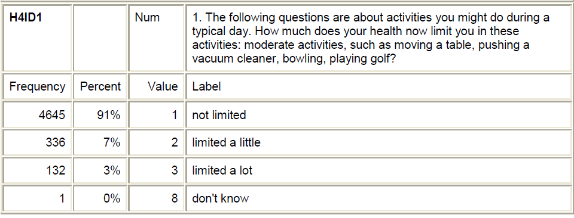
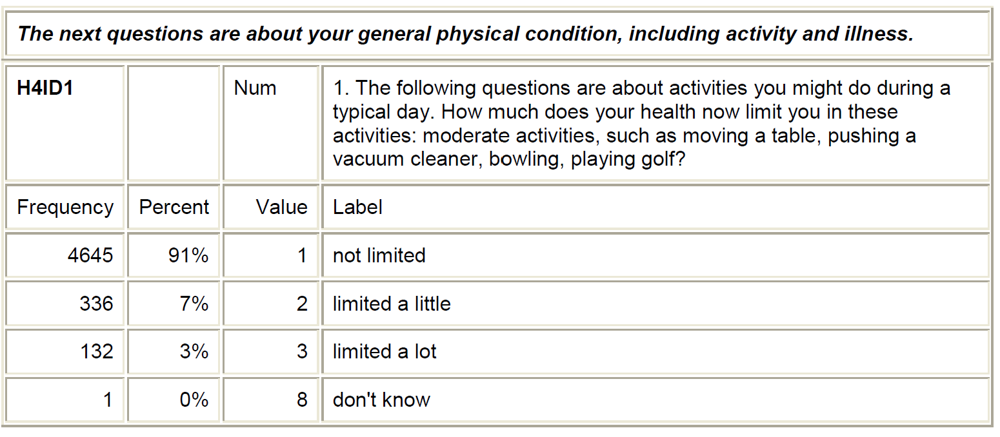
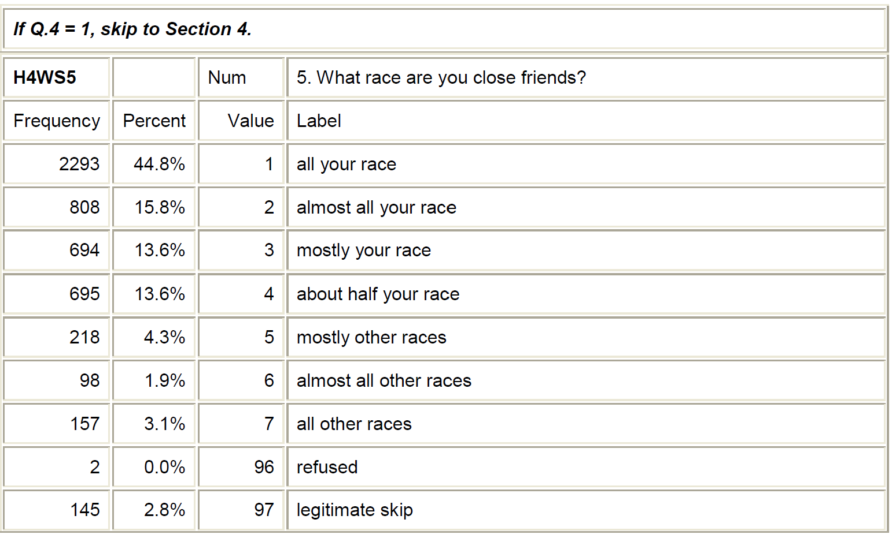

## Topic area statement: 

last thing----->??????

## Personal Codebook: 

To put the snips (images) in this document.  

First upload the images to the subfolder `image` of the`hw` folder. 
Then follow the example shown below

## Draft of a few Research Questions

Is someone's physical activity related to depression?

## Formative assessment:  Statistics Concepts

The following questions are to assess your understanding of our first two weeks' statistical topics.

8.  **Infections Can Lower IQ** A headline in June 2015 proclaims “Infections can lower IQ.” The headline is based on a study in which scientists gave an IQ test to Danish men at age 19. They also analyzed the hospital records of the men and found that 35% of them had been in a hospital with an infection such as an STI or a urinary tract infection. The average IQ score was lower for the men who had an infection than for the men who hadn’t.  

    + What are the cases in this study?
    + What is the explanatory variable? Is it categorical or quantitative?
    + What is the response variable? Is it categorical or quantitative?
    + Does the headline imply causation?
    + Is the study an experiment or an observational study?
    + Is it appropriate to conclude causation in this case?

\

9. **Hormones and Fish Fertility** When women take birth control pills, some of the hormones found in the pills eventually make their way into lakes and waterways. In one study, a water sample was taken from various lakes. The data indicate that as the concentration of estrogen in the lake water goes up, the fertility level of fish in the lake goes down. The estrogen level is measured in parts per trillion (ppt) and the fertility level is recorded as the percent of eggs fertilized. 

    + What are the cases in this study? 
    + What are the variables? 
    + Classify each variable as either categorical or quantitative.
    + Identify the explanatory and response variables.

\

10. **Drinking Age** A biased sampling situation is described for the following study;  

    To estimate the proportion of Americans who support changing the drinking age from 21 to 18, a random sample of 100 college students are asked the question, “Would you support a measure to lower the drinking age from 21 to 18?”  
    
    + What is the sample?
    + What is the researcher's population of interest?
    + To what population we can generalize to, (for our given sample)?

    
    
    
    