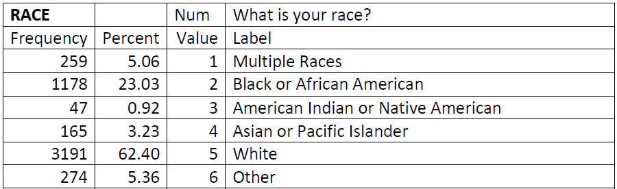
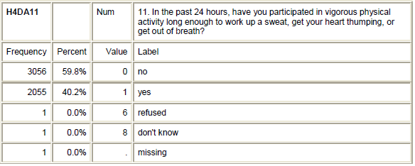
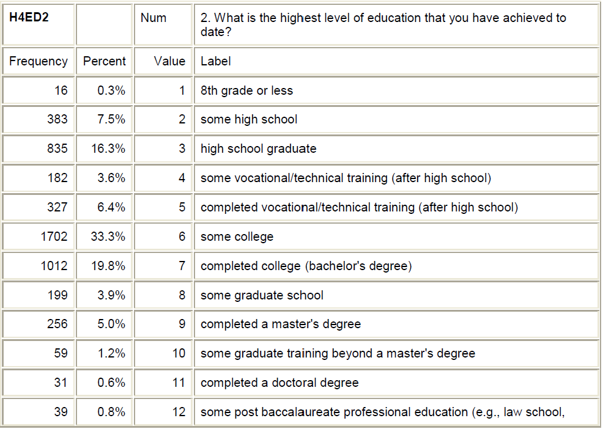
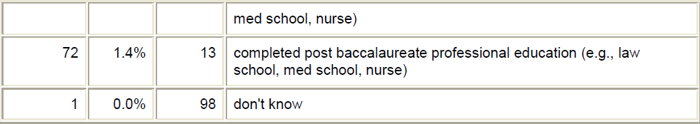

```{r, echo=F}
knitr::opts_chunk$set(echo = TRUE, warning=FALSE, message=FALSE) #Chunk default settings 
```

# Assignment Overview

By now you should know what variables you want to use, and you've looked over the codebook enough now that you have an idea of some potential problems that you will encounter. This assignment uses your chosen research data, and the variables that you chose in the last assignment when you created a personal research codebook. You will thoughtfully review the variables you are interested in, document which ones will need changed and how. 

All raw data needs to stay raw, and all changes need to be documented. You will create a script/code file that will make all changes to the data in a programatically and reproducible way. You will create a single code file that imports your raw data, performs some data cleaning steps, and saves out an analysis ready data set that you will use throughout the semester. 

You are **not** expected to have completed data management for every one of your variables under consideration by the submission date.   My expectation is that you have started the process and at least **4** variables have been recoded and confirmed that the recoding was successful (error-free).  

# Instructions 

1. Create your Assignment 3 Rmd with your name
    - `Save As` the `template.Rmd` so a new file is created with your name in it.

 
2. Library necessary packages
    - `dplyr` and `janitor` packages

```{r}
library(dplyr)
library(ggplot2)
library(janitor)
```


3.  Load in your data.

Load in your raw data file - with `load` command for the `addhealth4` data
```{r}
load("/cloud/project/data/addhealth4.RData")
```


4.  Create a new data frame with just the variable that you are interested in.
    - Use the `select` function from `dplyr` package to select the variables from your codebook (**HW02**).  
    - As you select your variables put this selection into a new data frame called `mydata`. 
    - (Later you might need to add variable to your selection, which will just require you to modify and run this `Rmd`)


```{r}
addhealth4 %>% 
  tabyl(RACE, ETHNICITY)
```


```{r}
mydata <- addhealth4 %>% 
  select(RACE, BIO_SEX4, iyear4, h4od1y , H4GH1, H4GH7, H4GH8, H4MH2, H4MH7, H4MH9, H4MH22, H4MH23, H4MH24, H4MH25, H4DA11, H4ED2, H4KK15B )
```


```{r}
mydata %>% 
  tabyl(H4KK15B, BIO_SEX4) %>% 
  adorn_percentages("col")
```

5. Check each variable for necessary adjustments. Complete each of the following steps for each variable.
    - Recode the data as necessary 
    - Choose a variable name that you and your audience will understand
    - Always confirm your recodes worked as intended by creating another table or summary. 

## Example 1 -`RACE` variable.
Checking the Codebook  
{width=6in}

Let's look at the `RACE` variable using two methods

```{r}
glimpse(mydata)
```

We can see that `RACE` is coded with numbers 1 through 6. Replacing the coded numbers with the actual labels will make future analysis easier to understand.  

We will use the `recode_factor` function from `dplyr` to accomplish this *replacement* (**i.e., recoding**) task.
```{r}
mydata_c <- mydata %>% 
  mutate(race_c = recode_factor(RACE,
                                "5"="white",
                                "2"="black",
                                "4"="asian_pacific_islander",
                                "3"="native_american",
                                "1"="multiple_races",
                                "6"="other",
                                .ordered=T))
```

You should always confirm that your function did as intended.  You can check by comparing the two variables

```{r}
mydata_c %>% 
  select(RACE, race_c)
```

Another way to check is to create a table so you can see if the percentages in the codebook match for your newly constructe variable.

```{r}
mydata_c %>% 
  tabyl(race_c) %>% 
  adorn_pct_formatting(digits=2)
```

## Example 2 - `H4DA11` variable
Checking the codebook  


We'll do the same process.  In addition we'll choose a new varaible name so we don't need to remember what `H4DA11` means.

**Note - this time I am working off my new data frame `mydata_c`

```{r}
mydata_c <- mydata_c %>% 
  mutate(vigorous_activity = recode_factor(H4DA11,
                                "0"="no",
                                "1"="yes",
                                "6"="refused",
                                "8"="don't know",
                                .ordered=T))
```

**??? Should I have done something differently to handle the 1 missing ???**

Check
```{r}
mydata_c %>% 
tabyl(H4DA11, vigorous_activity)
```

```{r}
mydata_c %>% 
  tabyl(vigorous_activity) %>% 
  adorn_pct_formatting(digits=2)
```

## Example 3 -`H4ED2` variable.

Check the Codebook



This variables has 14 different levels, which could make analysis challenging.  So, one strategy is to collapse the levels to fewer.  **Need to complete for next semester**

## 

```{r}
sex <- addhealth4 %>% 
  select(H4RD14, H4RD14T, BIO_SEX4, RACE)

sex %>% 
  tabyl(H4RD14, H4RD14T)
```

```{r}
sex <- sex %>% 
  mutate(H4RD14C = recode(H4RD14T,
                          "1"=52,
                          "2"=12,
                          "3"=1
                          )) %>% 
  mutate(H4RD14C = na_if(H4RD14C,
                         "6")) %>% 
  mutate(H4RD14C = na_if(H4RD14C,
                         "8")) %>% 
  mutate(yearly_no_sex = round(H4RD14*H4RD14C,0))
  
```

```{r}
sex %>% 
  filter(yearly_no_sex < 500) %>% 
  ggplot(aes(x=yearly_no_sex, color=))+
  geom_histogram(binwidth=10, center=0.5, closed="left")+
  facet_wrap(~H4RD14T, ncol=1)
  
```

```{r}
sex %>% 
  filter(yearly_no_sex < 500, H4RD14T=="1") %>% 
  ggplot(aes(x=yearly_no_sex))+
  geom_density()+
  facet_wrap(~RACE, ncol=1)
  
```

6. Create your final cleaned data frame.
    - Select only the variables that you want to keep, so you only have the version of the variables that you want in your data frame.

```{r}
clean <- mydata_c %>% select(race_c, BIO_SEX4, iyear4, h4od1y , H4GH1, H4GH7, H4GH8, H4MH2, H4MH7, H4MH9, H4MH22, H4MH23, H4MH24, H4MH25, vigorous_activity)
```

You can also use `select` to remove variable with the `-variable`
```{r}
#clean <- mydata_c %>% select(-RACE, -H4DA11)
```


7. Save the resulting data set to your `data` folder as `datasetname_clean.Rdata` e.g. `addhealth_clean.Rdata`. 
    - This will serve as your analysis data set to do all your subsequent assignments on. 

```{r}
save(clean, file="/cloud/project/data/myaddhealth_clean.Rdata")
```


8.  Create a table with all your variables

Original Variable  |   New Variable  |    Description
-------------------|-----------------|------------------
RACE |  race_c  | subject's race
H4DA11 |vigorous_activity | In the past 24 hours, have you participated in vigorous physical activity long enough to work up a sweat, get your heart thumping, or get out of breath?
3rd v |  new name |  big long description j
H43455 | thought_suicide | During the past 12 months, have you ever seriously thought about
committing suicide?


col a |  colb |   col c 
-----|------|-----
123 |  numbers |  this is a description
456 |  2n num  |  this is not a description


